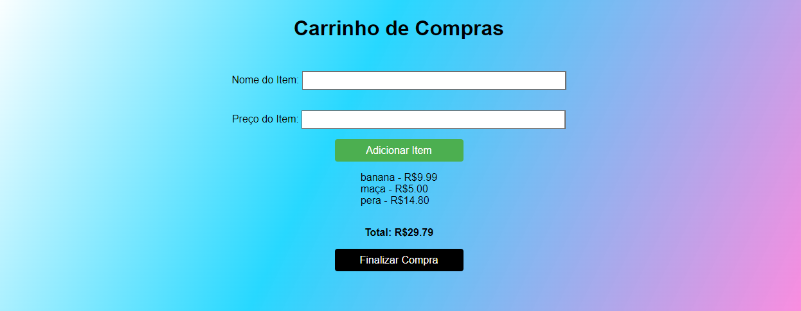

# Carrinho-de-Compras 🛒
Projeto feito com HTML, CSS e Javascript para simbolizar um carrinho de compras funcionando podendo adicionar itens e aparecendo automaticamente o total a pagar no fim da página conforme a soma dos valores de cada item.

## Como rodar o projeto ⚙️
Basta ter a extensão Live Server e clicar em `Go Live` para o projeto rodar no navegador padrão

